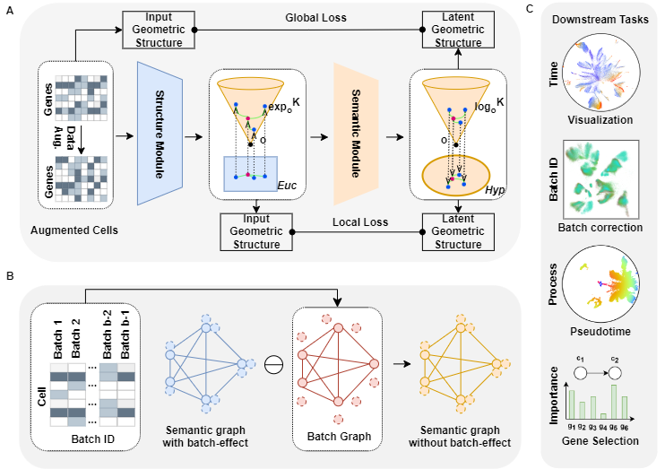

## Complex hierarchical structures analysis in single-cell data with Poincaré deep manifold transformation

## Overview

## Installation

1. **Install dependencies**:
conda env create -f env.yaml

2. **Activate environment**:
conda activate poincaredmt

## Usage

1. **Dimensionality reduction**:
python main.py

2. **Batch correction**:
python main_batch_correction.py

3. **Visualization and Pseudotime inference**:
python main_visualization_pseudotime.py

4. **Gene selection**:
python main_gene_selection.py

5. **Baseline**:
python main_baseline.py || main_baseline_batch_correction.py

## Contact

If you have any problem about this package, please create an Issue or send us an Email at:
- **Author**: [Yongjie Xu][xuyongjie@westlake.edu.cn]
- **Author**: [Zelin Zang][zangzelin@westlake.edu.cn]
